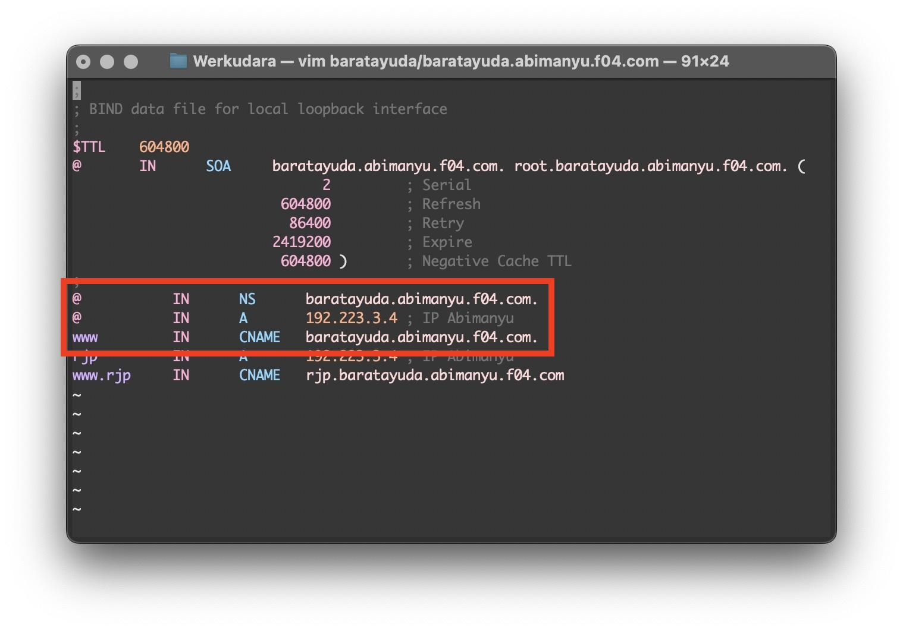
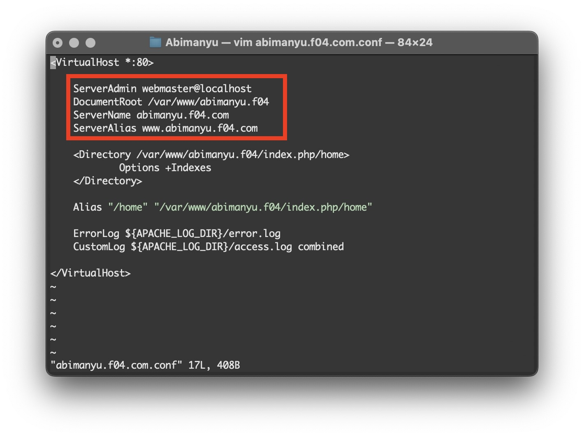

# Jarkom-Modul-1-F04-2023

## Anggota Kelompok

1. 5025211149 - Irsyad Fikriansyah Ramadhan
2. 5025211158 - Ghifari Maaliki Syafa Syuhada

| Kelompok | Prefix IP |
|----------|-----------|
| F04      | 192.223   |

## Pendahuluan

Dalam pengerjaan ini, kami menegerjakan semua soal dalam 1 buah script.sh file yang disimpan pada directory /root dalam setiap node. Script pada setiap node berisikan command-command yang perlu dijalankan untuk menjawab soal 1 hingga 20. Agar script yang telah dibuat, berjalan ketika awal - awal node dijalankan.

dalam setiap /root juga terdapat install-script.sh yang berisikan command untuk meng-install apt yang diperlukan setiap node yang akan terpanggil saat script.sh dijalankan.

Kemudian, setiap node selain DNS server dan Router, diberikan nameserver ip address dari DNS master dan slave. Agar dapat mengakses ip diluar DNS server, maka pada DNS server perlu untuk ditambahkan forwarder. Hal tersebut dapat dilakukan dengan mengubah file named.conf.options pada node DNS Server seperti pada modul jarkom 2023

## Soal 1

Yudhistira akan digunakan sebagai DNS Master, Werkudara sebagai DNS Slave, Arjuna merupakan Load Balancer yang terdiri dari beberapa Web Server yaitu Prabakusuma, Abimanyu, dan Wisanggeni. Buatlah topologi dengan pembagian sebagai berikut. Folder topologi dapat diakses pada drive berikut

<hr style="width:60%;text-align:center">


Konfigurasi setiap node sebagai berikut:


Router: 
 - **Pandudewanata**
    ```
    auto eth0
    iface eth0 inet dhcp

    auto eth1
    iface eth1 inet static
    address 192.223.1.1
    netmask 255.255.255.0

    auto eth2
    iface eth2 inet static
    address 192.223.2.1
    netmask 255.255.255.0

    auto eth3
    iface eth3 inet static
    address 192.223.3.1
    netmask 255.255.255.0
    ```

Client:
 - **Sadewa**
    ```
    auto eth0
    iface eth0 inet static
	address 192.223.1.2
	netmask 255.255.255.0
	gateway 192.223.1.1
    ```
 - **Nakula**
    ```
    auto eth0
    iface eth0 inet static
	address 192.223.1.3
	netmask 255.255.255.0
	gateway 192.223.1.1
    ```

DNS Server:
 - **Yudhistira**
    ```
    auto eth0
    iface eth0 inet static
	address 192.223.2.2
	netmask 255.255.255.0
	gateway 192.223.2.1
    ```
 - **Werkudara**
    ```
    auto eth0
    iface eth0 inet static
	address 192.223.2.3
	netmask 255.255.255.0
	gateway 192.223.2.1
    ```

Load Balancer:
 - **Arjuna**
    ```
    auto eth0
    iface eth0 inet static
	address 192.223.3.2
	netmask 255.255.255.0
	gateway 192.223.3.1
    ```

Web Server:
 - **Prabukusuma**
    ```
    auto eth0
    iface eth0 inet static
	address 192.223.3.3
	netmask 255.255.255.0
	gateway 192.223.3.1
    ```
 - **Wisanggeni**
    ```
    auto eth0
    iface eth0 inet static
	address 192.223.3.4
	netmask 255.255.255.0
	gateway 192.223.3.1
    ```
 - **Abimanyu**
    ```
    auto eth0
    iface eth0 inet static
	address 192.223.3.5
	netmask 255.255.255.0
	gateway 192.223.3.1
    ```


## Soal 2

Buatlah website utama pada node arjuna dengan akses ke arjuna.yyy.com dengan alias www.arjuna.yyy.com dengan yyy merupakan kode kelompok.

<hr style="width:60%;text-align:center">

**Yudhistira**<br>
/root/script.sh


/root/arjuna/arjuna.f04.com


/root/named.conf.local


hasil:
 

## Soal 3

Dengan cara yang sama seperti soal nomor 2, buatlah website utama dengan akses ke abimanyu.yyy.com dan alias www.abimanyu.yyy.com.

<hr style="width:60%;text-align:center">

**Yudhistira**<br>
/root/script.sh


/root/abimanyu/abimanyu.f04.com


/root/named.conf.local


hasil:


## Soal 4

Kemudian, karena terdapat beberapa web yang harus di-deploy, buatlah subdomain parikesit.abimanyu.yyy.com yang diatur DNS-nya di Yudhistira dan mengarah ke Abimanyu.

<hr style="width:60%;text-align:center">

**Yudhistira**<br>
/root/abimanyu/abimanyu.f04.com
 

hasil:


## Soal 5

Buat juga reverse domain untuk domain utama. (Abimanyu saja yang direverse)

<hr style="width:60%;text-align:center">

**Yudhistira**<br>
/root/script.sh


/root/abimanyu/3.223.192.in-addr.arpa


/root/named.conf.local


hasil:


## Soal 6

Agar dapat tetap dihubungi ketika DNS Server Yudhistira bermasalah, buat juga Werkudara sebagai DNS Slave untuk domain utama.

<hr style="width:60%;text-align:center">

**Yudhistira**<br>
/root/script.sh


/root/abimanyu/named.conf.local


**Werkudara**<br>
/root/script.sh


/root/named.conf.local


hasil:
<br>
\* (bind9 pada Yudhistira telah di stop)

## Soal 7

Seperti yang kita tahu karena banyak sekali informasi yang harus diterima, buatlah subdomain khusus untuk perang yaitu baratayuda.abimanyu.yyy.com dengan alias www.baratayuda.abimanyu.yyy.com yang didelegasikan dari Yudhistira ke Werkudara dengan IP menuju ke Abimanyu dalam folder Baratayuda.

<hr style="width:60%;text-align:center">

**Yudhistira**<br>
/root/abimanyu/abimanyu.f04.com


**Werkudara**<br>
/root/baratayuda/baratayuda.abimanyu.f04.com


/root/named.conf.local


hasil:


## Soal 8

Untuk informasi yang lebih spesifik mengenai Ranjapan Baratayuda, buatlah subdomain melalui Werkudara dengan akses rjp.baratayuda.abimanyu.yyy.com dengan alias www.rjp.baratayuda.abimanyu.yyy.com yang mengarah ke Abimanyu.

<hr style="width:60%;text-align:center">

**Wekudara**<br>
/root/baratayuda/baratayuda.abimanyu.f04.com


hasil:


## Soal 9

Arjuna merupakan suatu Load Balancer Nginx dengan tiga worker (yang juga menggunakan nginx sebagai webserver) yaitu Prabakusuma, Abimanyu, dan Wisanggeni. Lakukan deployment pada masing-masing worker.

<hr style="width:60%;text-align:center">

Pada soal ini setiap worker di-install dengan nginx. Command installasi nginx kami taruh pada /root/install-script.sh yang nantinya akan dipanggil oleh script.sh

**Arjuna, Prabukusuma, Abimanyu, Wisanggeni**<br>
/root/install-script.sh


## Soal 10

"Kemudian gunakan algoritma Round Robin untuk Load Balancer pada Arjuna. Gunakan server_name pada soal nomor 1. Untuk melakukan pengecekan akses alamat web tersebut kemudian pastikan worker yang digunakan untuk menangani permintaan akan berganti ganti secara acak. Untuk webserver di masing-masing worker wajib berjalan di port 8001-8003. Contoh
    - Prabakusuma:8001
    - Abimanyu:8002
    - Wisanggeni:8003"

<hr style="width:60%;text-align:center">

**Arjuna**<br>
/root/script.sh


/root/arjuna-lb.sh


## Soal 11

Selain menggunakan Nginx, lakukan konfigurasi Apache Web Server pada worker Abimanyu dengan web server www.abimanyu.yyy.com. Pertama dibutuhkan web server dengan DocumentRoot pada /var/www/abimanyu.yyy

<hr style="width:60%;text-align:center">

**Abimanyu**<br>
/root/script.sh


/root/abimanyu.f04.com.conf


## Soal 12

Setelah itu ubahlah agar url www.abimanyu.yyy.com/index.php/home menjadi www.abimanyu.yyy.com/home.

<hr style="width:60%;text-align:center">

**Abimanyu**<br>
/root/abimanyu.f04.com.conf


## Soal 13

Selain itu, pada subdomain www.parikesit.abimanyu.yyy.com, DocumentRoot disimpan pada /var/www/parikesit.abimanyu.yyy

<hr style="width:60%;text-align:center">

**Abimanyu**<br>
/root/script.sh


/root/parikesit.abimanyu.f04.com.conf


## Soal 14

Pada subdomain tersebut folder /public hanya dapat melakukan directory listing sedangkan pada folder /secret tidak dapat diakses (403 Forbidden).

<hr style="width:60%;text-align:center">

**Abimanyu**<br>
/root/parikesit.abimanyu.f04.com.conf


## Soal 15

Buatlah kustomisasi halaman error pada folder /error untuk mengganti error kode pada Apache. Error kode yang perlu diganti adalah 404 Not Found dan 403 Forbidden.

<hr style="width:60%;text-align:center">

**Abimanyu**<br>
/root/parikesit.abimanyu.f04.com.conf


## Soal 16

Buatlah suatu konfigurasi virtual host agar file asset www.parikesit.abimanyu.yyy.com/public/js menjadi www.parikesit.abimanyu.yyy.com/js


**Abimanyu**<br>
/root/parikesit.abimanyu.f04.com.conf


## Soal 17

Agar aman, buatlah konfigurasi agar www.rjp.baratayuda.abimanyu.yyy.com hanya dapat diakses melalui port 14000 dan 14400.

<hr style="width:60%;text-align:center">

**Abimanyu**<br>
/root/script.sh


/root/.htaccess.sh


/root/rjp.baratayuda.abimanyu.f04.com.conf


## Soal 18

Untuk mengaksesnya buatlah autentikasi username berupa “Wayang” dan password “baratayudayyy” dengan yyy merupakan kode kelompok. Letakkan DocumentRoot pada /var/www/rjp.baratayuda.abimanyu.yyy.

<hr style="width:60%;text-align:center">

**Abimanyu**<br>
/root/script.sh


<!-- 

## Soal 19


## Soal 20

-->